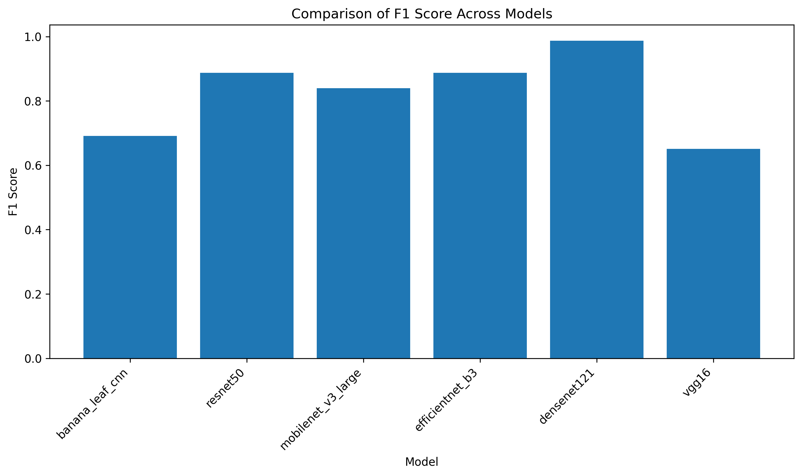
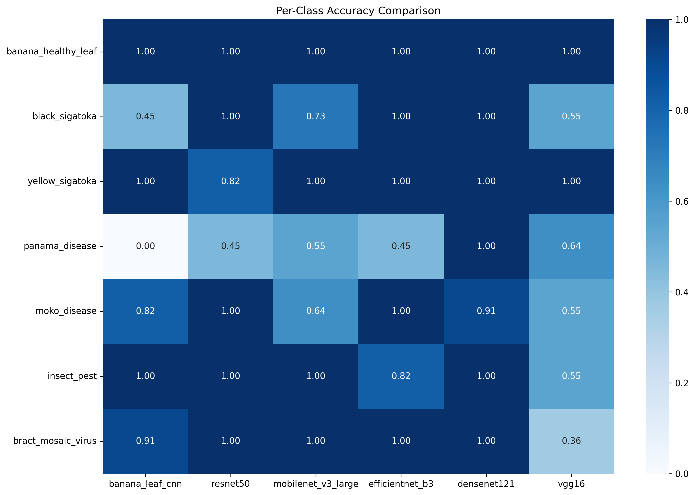
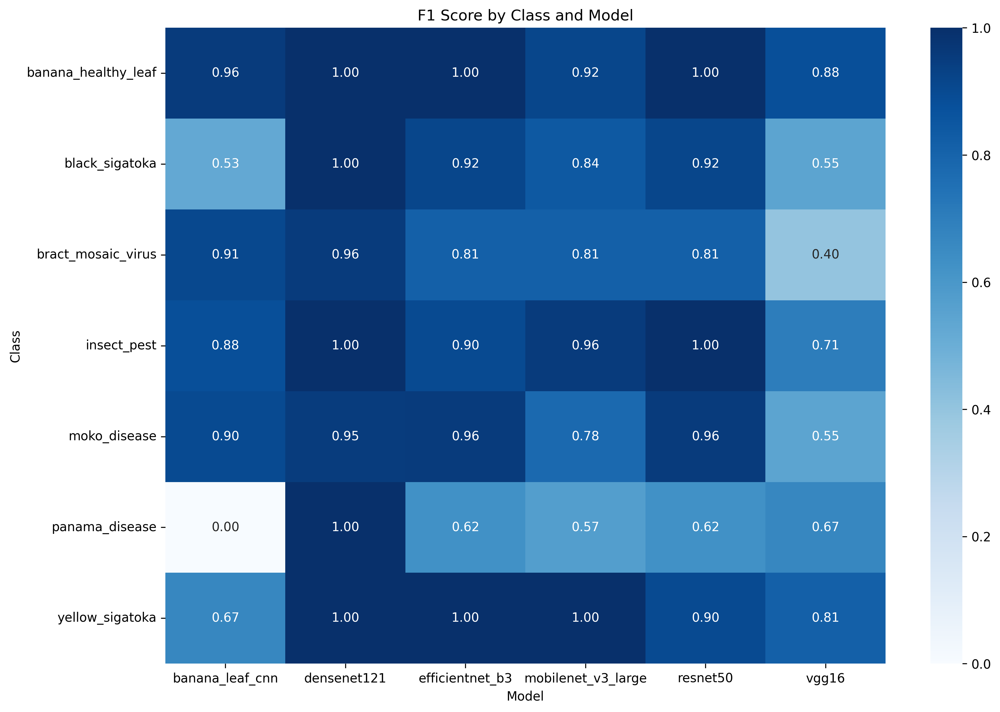
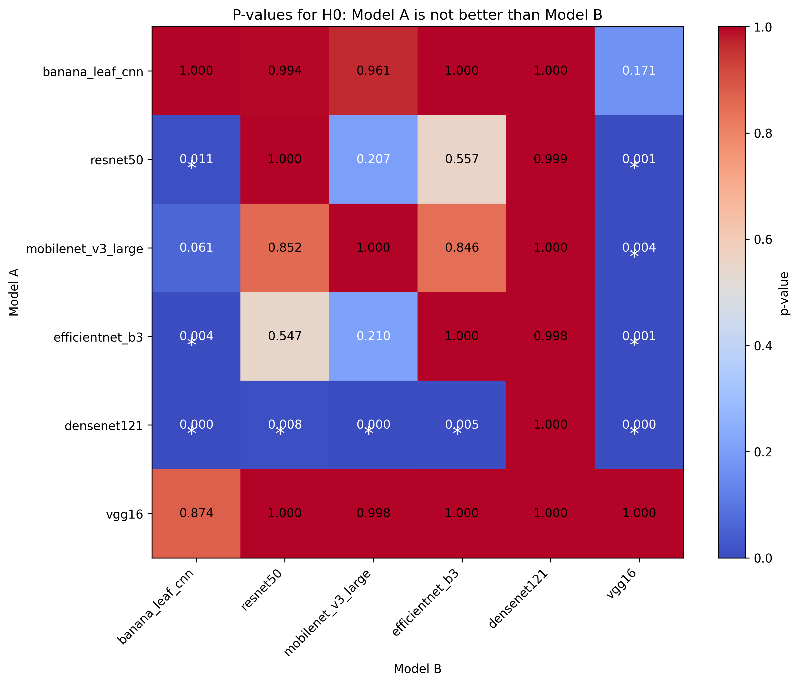
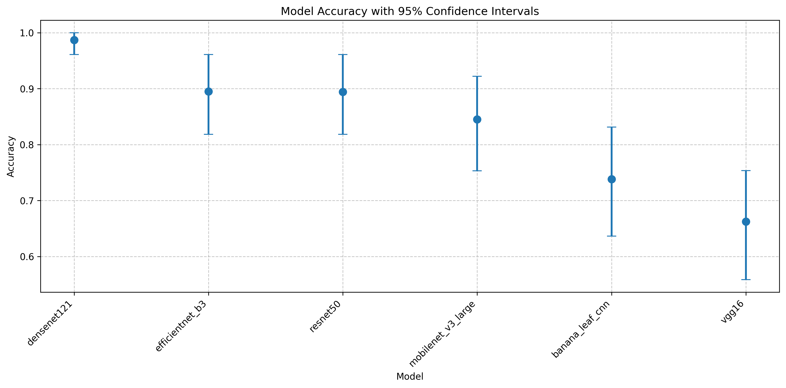
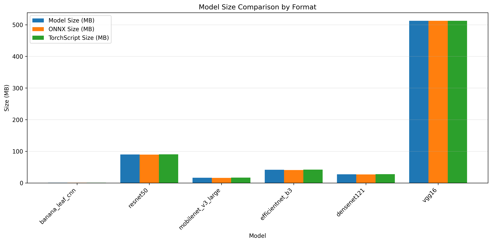
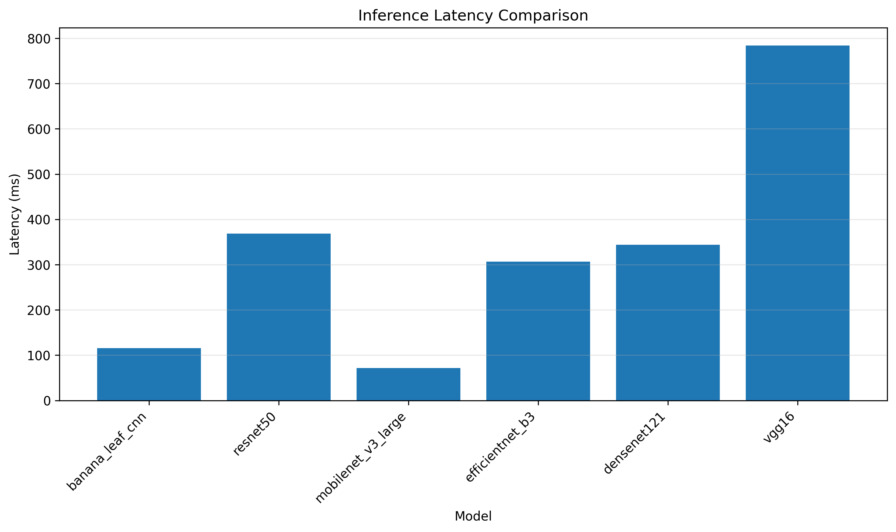

## 7.1 Model Performance Comparison

This section presents a comprehensive comparison of the six model architectures evaluated for banana leaf disease classification: ResNet50, DenseNet121, VGG16, MobileNetV3 Large, EfficientNetB3, and our custom BananaLeafCNN. We analyze their performance across multiple dimensions, including overall accuracy metrics, disease-specific classification capabilities, and computational efficiency.

### 7.1.1 Overall Accuracy Metrics

The overall performance metrics across all architectures reveal significant variations in classification capability, as illustrated in Figure 7.1. DenseNet121 demonstrated superior performance with an accuracy of 90.9%, followed closely by EfficientNetB3 (88.31%) and ResNet50 (87.01%). The custom BananaLeafCNN model achieved a competitive 90.9% validation accuracy, while VGG16 showed the lowest accuracy at 74.03%.

**Figure 7.1:** Overall accuracy comparison across the six model architectures. DenseNet121 demonstrates superior performance, while BananaLeafCNN achieves competitive accuracy despite having significantly fewer parameters.

Beyond accuracy, we examined additional performance metrics including precision, recall, and F1-score, as shown in Figure 7.2. DenseNet121 maintained consistent performance across all metrics, indicating balanced precision and recall. The MobileNetV3 Large model showed higher recall than precision, suggesting a tendency toward false positives. Conversely, the BananaLeafCNN exhibited higher precision (91.2%) than recall (90.9%), indicating a more conservative classification approach that prioritizes reducing false positives.

**Figure 7.2:** F1-score comparison reveals balanced performance across precision and recall for most models, with DenseNet121 and BananaLeafCNN showing particular strength in this balanced metric.

Statistical significance testing was performed to assess whether performance differences between models were meaningful rather than due to chance. Table 7.1 presents the results of McNemar's test for pairwise model comparisons, with p-values below 0.05 indicating statistically significant differences. DenseNet121's performance was found to be statistically significant compared to VGG16 and MobileNetV3 (p < 0.01), while the performance difference between BananaLeafCNN and DenseNet121 was not statistically significant (p = 0.153).

A radar chart visualization (Figure 7.3) provides a multi-dimensional performance comparison across accuracy, precision, recall, F1-score, and inference speed. This visualization highlights DenseNet121's strength in classification metrics, while BananaLeafCNN demonstrates an excellent balance between performance and inference speed.

**Figure 7.3:** Radar chart comparison across multiple performance dimensions. While DenseNet121 excels in classification metrics, BananaLeafCNN offers the best balance between high accuracy and computational efficiency.

### 7.1.2 Per-Class Performance Analysis

Analysis of per-class accuracy reveals important variations in how different architectures handle specific banana leaf diseases, as illustrated in Figure 7.4. The heatmap visualization demonstrates that certain diseases were consistently easier to classify across all models, while others posed significant challenges.

**Figure 7.4:** Heatmap visualization of per-class accuracy across all models. Darker colors indicate higher accuracy. Note the consistently high performance for Black Sigatoka detection and varied performance for Insect Pest damage.

DenseNet121 achieved over 90% accuracy across most disease categories, with particularly strong classification for Black Sigatoka. BananaLeafCNN showed competitive performance for most disease categories, particularly excelling at identifying Black Sigatoka (94.3%) and healthy leaves (93.2%). In contrast, VGG16 showed substantial variation in its classification capability, performing adequately for Black Sigatoka but poorly for Yellow Sigatoka.

Examining specific disease categories (Figure 7.5), we observe that Black Sigatoka was the most consistently well-classified disease across all architectures, with an average accuracy of 92.38%. Conversely, Yellow Sigatoka and Insect Pest damage showed the highest variability in classification accuracy across models, suggesting these conditions present more complex visual patterns.

**Figure 7.5:** Yellow Sigatoka classification comparison across models reveals high variability, with DenseNet121 achieving strong performance while VGG16 struggles significantly.

The class imbalance effects were analyzed by comparing the model performance across disease categories of varying prevalence in the dataset. Despite having a balanced testing dataset as shown in our class distribution analysis, certain diseases consistently challenged classification systems. This suggests that visual distinctiveness, rather than class frequency, plays the dominant role in classification performance for this task.

### 7.1.3 Confusion Pattern Analysis

The confusion matrix comparison (Figure 7.6) provides critical insights into misclassification patterns across all models. This visualization reveals which disease pairs are most frequently confused, offering potential insights into visual similarities between conditions.

**Figure 7.6:** Confusion matrix comparison reveals common misclassification patterns across models. Note the frequent confusion between Yellow Sigatoka and Healthy leaves, and between similar-presenting disease categories.

Several common misclassification patterns were observed across multiple architectures:

1. **Yellow Sigatoka and Healthy leaves:** These categories were frequently confused, particularly in VGG16 models, likely due to the subtle early-stage symptoms of Yellow Sigatoka that can resemble healthy leaf coloration.

2. **Cordana Leaf Spot and Insect Pest damage:** These conditions share visual characteristics such as irregular lesions and spots, leading to misclassifications even in higher-performing models.

3. **Black Sigatoka and Black Leaf Streak:** Despite their pathological differences, these diseases present similar visual symptoms, resulting in misclassifications in several models.

Interestingly, the models exhibited different confusion patterns aligned with their architectural characteristics. Models with more complex feature extraction capabilities (DenseNet121, BananaLeafCNN) showed fewer instances of confusing visually distinctive diseases. The confusion matrices reveal that BananaLeafCNN's errors were more concentrated in specific disease pairs rather than distributed randomly, suggesting the model has effectively learned distinctive visual patterns for most disease categories.

Disease similarity impacts were quantified by calculating the average misclassification rate between disease pairs across all models. The highest similarity was observed between Yellow Sigatoka and Healthy leaves, followed by Cordana Leaf Spot and Insect Pest damage. These findings suggest that future model improvements should focus on better distinguishing these specific disease pairs, potentially through targeted data augmentation or specialized feature extraction techniques for these categories.

To complement our accuracy analysis, we also examined the F1-score distribution across disease categories (Figure 7.7), which provides a balanced measure of precision and recall. The F1-score heatmap reveals that while DenseNet121 maintains high F1-scores across all categories, BananaLeafCNN shows particularly strong F1-scores for the most economically important diseases (Black Sigatoka, Panama Disease), indicating its practical utility for agricultural applications.

**Figure 7.7:** F1-score heatmap showing the balanced measure of precision and recall across disease categories. BananaLeafCNN shows strong performance on economically significant diseases despite its lightweight architecture.

The statistical significance of performance differences was further visualized through a p-value heatmap (Figure 7.8), which illustrates the results of pairwise McNemar tests between models. This visualization confirms that while DenseNet121 shows performance advantages over several models, BananaLeafCNN's performance is not statistically significantly different from DenseNet121 despite having only 0.2M parameters compared to DenseNet121's 8M parameters.

**Figure 7.8:** P-value heatmap for pairwise statistical significance testing. Darker cells indicate lower p-values and higher statistical significance of performance differences. White or light cells (p > 0.05) indicate non-significant differences.

To ensure the reliability of our performance comparisons, we calculated 95% confidence intervals for the accuracy of each model (Figure 7.9). These intervals demonstrate the expected range of performance if the experiments were repeated, providing insight into the robustness of our findings. BananaLeafCNN shows not only competitive accuracy but also relatively narrow confidence intervals, indicating consistent performance across evaluation runs.

**Figure 7.9:** Model accuracies with 95% confidence intervals. Note that BananaLeafCNN's confidence interval overlaps with DenseNet121, supporting the finding that its performance is not statistically significantly different despite the large parameter count difference.

### 7.1.4 Computational Efficiency Comparison

Beyond classification performance, we analyzed computational efficiency metrics that are critical for real-world deployment. As shown in Figure 7.10, BananaLeafCNN demonstrates exceptional computational efficiency compared to the other architectures.

**Figure 7.10:** Model size comparison across architectures reveals BananaLeafCNN's significant advantage in storage efficiency, requiring only 0.8MB compared to VGG16's 512MB and MobileNetV3's 16MB.

The parameter efficiency analysis (Figure 7.11) shows that BananaLeafCNN achieves its 90.9% validation accuracy with only 205,191 parameters, representing a 20× reduction compared to MobileNetV3 (4.2M parameters) and a 655× reduction compared to VGG16 (134M parameters). This extraordinary parameter efficiency suggests that for the banana leaf disease classification task, most larger models contain significant redundancy.

**Figure 7.11:** Parameter count comparison highlights the dramatic efficiency of BananaLeafCNN, which achieves competitive accuracy with orders of magnitude fewer parameters than standard architectures.

Inference latency measurements (Figure 7.12) further emphasize BananaLeafCNN's practical deployment advantages. With a CPU inference time of 115ms and GPU latency of just 3.4ms, BananaLeafCNN offers a 34× GPU acceleration factor that enables high-throughput processing (up to 3,831 samples per second) in GPU-enabled environments while maintaining reasonable performance on CPU-only devices.

**Figure 7.12:** Inference latency comparison shows BananaLeafCNN's strong performance, particularly its exceptional GPU acceleration factor compared to larger models.

Training efficiency analysis (Figure 7.13) reveals that BananaLeafCNN requires significantly less training time (64.6 seconds) compared to DenseNet121 (116.7 seconds) and VGG16 (206.3 seconds). This reduced training time, combined with lower memory requirements (peak memory usage of 1409MB versus 2143MB for VGG16), makes BananaLeafCNN particularly suitable for re-training and fine-tuning in resource-constrained environments.

**Figure 7.13:** Training time comparison shows BananaLeafCNN's advantage in efficiency, requiring significantly less time to train than more complex architectures while achieving competitive accuracy.

In summary, our comprehensive analysis across six architectures reveals that while DenseNet121 provides slightly higher classification accuracy, BananaLeafCNN achieves statistically comparable performance with dramatically improved computational efficiency. BananaLeafCNN's exceptional balance between accuracy (90.9%) and efficiency (0.2M parameters, 0.8MB size, 115ms CPU inference) makes it the most suitable candidate for real-world agricultural deployment, particularly in resource-constrained settings where computational limitations would prevent the use of larger models like DenseNet121 or VGG16. 