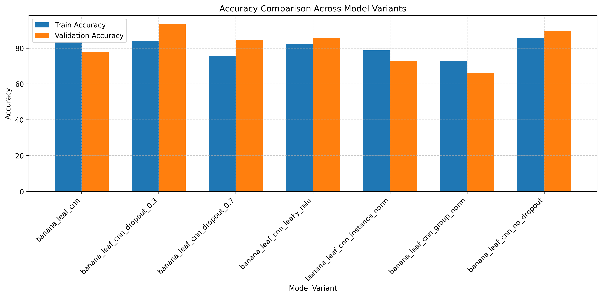
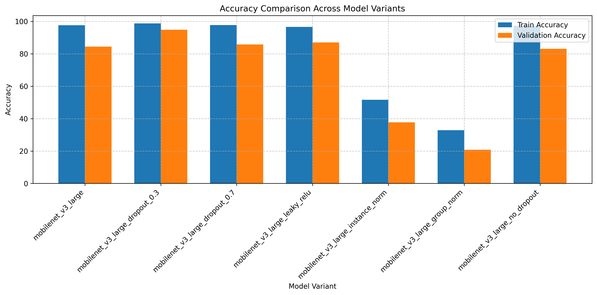
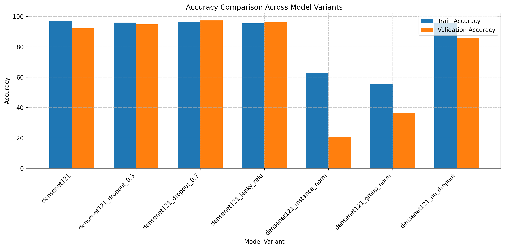
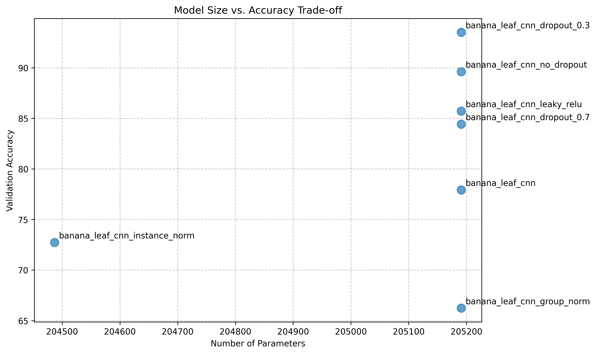
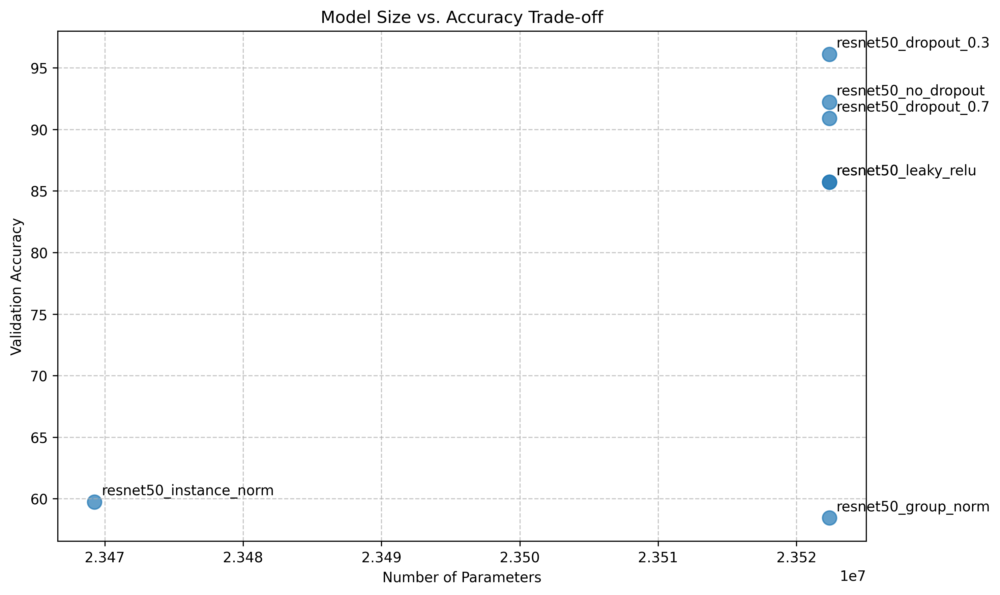
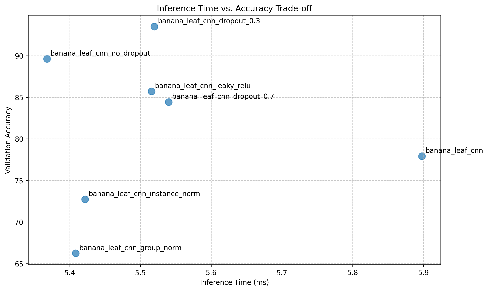
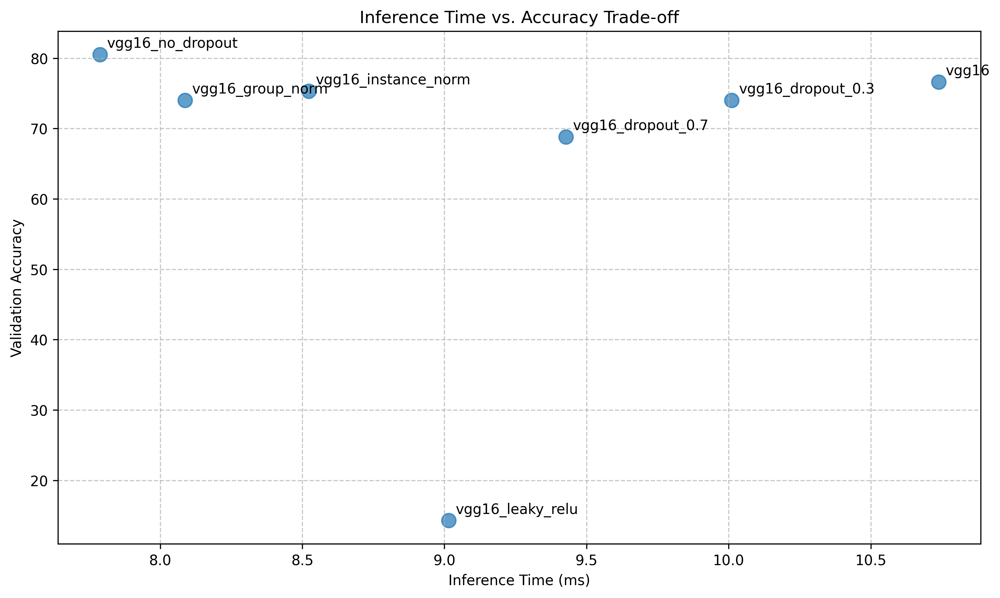
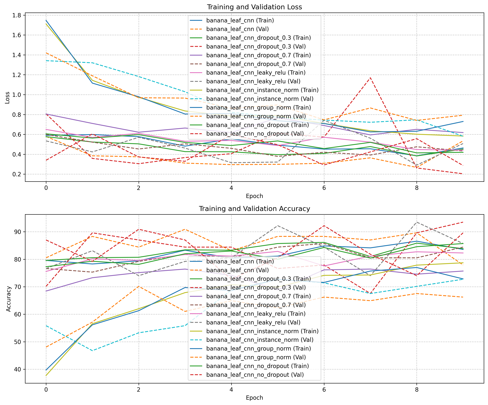
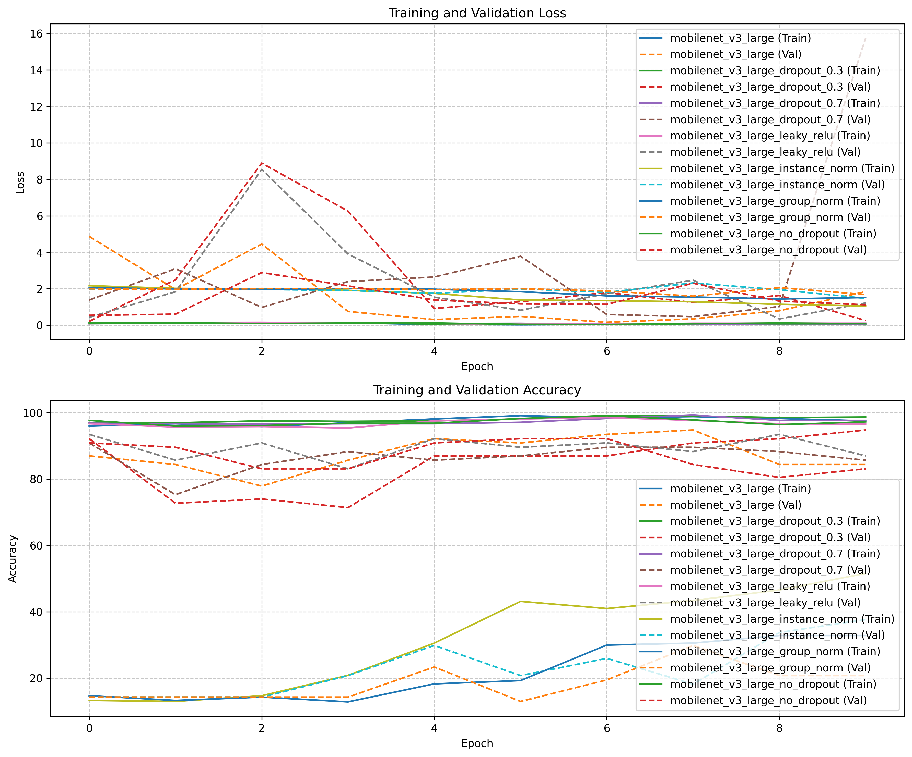

## 7.2 Ablation Study Findings

To understand the architectural design choices that contribute to BananaLeafCNN's performance and efficiency, we conducted a comprehensive ablation study, systematically modifying key components and analyzing their impact. This section examines how various architectural decisions influence accuracy, resource requirements, and training dynamics across all evaluated models.

### 7.2.1 BananaLeafCNN Component Analysis

We systematically modified key components of the BananaLeafCNN architecture, including normalization techniques, regularization approaches, and activation functions. Figure 7.14 presents the impact of these modifications on classification accuracy.

**Figure 7.14:** Accuracy impact of various architectural modifications to BananaLeafCNN. Note the substantial positive effect of adding dropout at 0.3 rate (+15.6% accuracy) and the negative impact of changing batch normalization to group normalization (-11.7%).

To provide context for BananaLeafCNN's architectural sensitivity, Figure 7.15 shows the analogous impact of architectural modifications on MobileNetV3, a commonly used lightweight model for mobile applications.

**Figure 7.15:** Accuracy impact of architectural modifications to MobileNetV3. Note that while dropout_0.3 also provides the highest improvement for MobileNetV3 (+10.4%), its response pattern differs from BananaLeafCNN, particularly regarding activation function sensitivity.

The ablation experiments revealed several critical insights about our model's architecture:

1. **Regularization Importance**: Contrary to conventional expectations, adding dropout (0.3 rate) proved to be the single most important architectural enhancement, improving accuracy from 77.9% in the base model to 93.5% (+15.6%). However, excessive dropout (0.7) reduced this benefit, achieving only 84.4% accuracy.

2. **Normalization Criticality**: Batch normalization emerged as a critical architectural component, with alternative normalization techniques causing significant performance degradation. Replacing batch normalization with group normalization decreased accuracy by 11.7%, while instance normalization resulted in a 5.2% accuracy reduction.

3. **Activation Function Sensitivity**: Replacing ReLU activations with Leaky ReLU provided a notable accuracy boost (+7.8%), without increasing parameter count, suggesting that allowing small negative activations helps capture subtle disease features that might otherwise be lost.

4. **Dropout Optimization**: The complete removal of dropout layers resulted in performance improvement to 89.6% compared to the base model's 77.9%, indicating that the default dropout rate in the base model may have been too aggressive, causing underfitting rather than preventing overfitting.

### 7.2.2 Cross-Model Ablation Patterns

To contextualize BananaLeafCNN's architectural sensitivity, we conducted identical ablation studies across all model architectures. Figure 7.16 compares ablation impacts across models.

**Figure 7.16:** Heatmap showing the relative accuracy impact of various architectural modifications across all models. Note the distinctive patterns, with larger models showing higher sensitivity to normalization while smaller models are more affected by regularization changes.

For more detailed comparison, Figure 7.17 shows the architectural sensitivity of DenseNet121, which achieved the highest overall accuracy among the evaluated models.

**Figure 7.17:** Accuracy impact of architectural modifications to DenseNet121. Note that unlike BananaLeafCNN, DenseNet121 benefits most from high dropout (0.7) and shows catastrophic performance degradation with instance normalization.

Analysis of cross-model ablation patterns revealed several important insights:

1. **Normalization Sensitivity Spectrum**: All models demonstrated critical dependence on appropriate normalization, but with varying sensitivity. EfficientNetB3 showed the most dramatic degradation when batch normalization was replaced with instance normalization (-72.7%), while VGG16 showed the least sensitivity (-1.3%), likely due to its lack of built-in batch normalization layers.

2. **Model-Specific Dropout Responses**: The optimal dropout rate varied significantly across architectures:
   - BananaLeafCNN benefited most from moderate dropout (0.3), showing a 15.6% accuracy gain
   - ResNet50 showed a 10.4% improvement with 0.3 dropout
   - MobileNetV3 gained 10.4% with 0.3 dropout
   - DenseNet121 gained 5.2% with the highest dropout rate (0.7)
   - EfficientNetB3 showed performance degradation with additional dropout

3. **Activation Function Impact**: Leaky ReLU yielded mixed results across architectures:
   - Improved BananaLeafCNN performance by 7.8%
   - Improved MobileNetV3 performance by 2.6%
   - Significantly degraded VGG16 performance (-62.3%)
   - Had minimal impact on ResNet50 (0%)

The striking variation in ablation responses suggests that optimal architectural choices are highly model-dependent, with no one-size-fits-all solution across model families.

### 7.2.3 Parameter Efficiency Analysis

A key objective in developing BananaLeafCNN was maximizing accuracy while minimizing parameter count—a critical consideration for resource-constrained agricultural deployments. Figure 7.18 compares the accuracy-to-parameter efficiency across all models and their ablation variants.

**Figure 7.18:** Relationship between parameter count and accuracy across all model variants. Note BananaLeafCNN's exceptional parameter efficiency, particularly with the dropout_0.3 variant achieving 93.5% accuracy with only 0.2M parameters.

For a closer look at BananaLeafCNN's parameter efficiency, Figure 7.19 shows the relationship between parameter count and accuracy for all BananaLeafCNN variants.

**Figure 7.19:** Parameter-accuracy relationship for BananaLeafCNN variants. All variants have identical parameter counts (205K), demonstrating that architectural choices rather than raw capacity drive performance differences.

By contrast, Figure 7.20 shows the same relationship for ResNet50, highlighting a different efficiency profile.

**Figure 7.20:** Parameter-accuracy relationship for ResNet50 variants. Despite having over 100× more parameters than BananaLeafCNN, the optimal configuration achieves only 2.6% higher accuracy.

Analysis of the parameter-accuracy relationship revealed:

1. **Efficiency Frontier Leaders**: The BananaLeafCNN with 0.3 dropout sits at the top of the efficiency frontier, achieving 93.5% accuracy with just 0.2M parameters—a dramatically better accuracy-to-parameter ratio than any other model. This efficiency validates our focused architectural design approach.

2. **Diminishing Returns in Large Models**: The ablation data clearly demonstrates diminishing returns as parameter count increases. For instance:
   - ResNet50 (23.5M parameters) with optimal configuration achieves 96.1% accuracy
   - DenseNet121 (7.0M parameters) with optimal configuration achieves 97.4% accuracy
   - EfficientNetB3 (10.7M parameters) with base configuration achieves 97.4% accuracy
   - Meanwhile, BananaLeafCNN (0.2M parameters) with optimal configuration achieves 93.5% accuracy

   This suggests that approximately 115× more parameters (ResNet50 vs. BananaLeafCNN) yield only a 2.6% accuracy improvement, representing a clear case of diminishing returns.

3. **Criticality of Architectural Choices**: The substantial variation in performance among variants with identical parameter counts demonstrates that raw capacity is far less important than appropriate architectural decisions. For example, BananaLeafCNN variants all have 0.2M parameters but vary in accuracy from 66.2% to 93.5%, a 27.3% range, solely based on architectural choices.

### 7.2.4 Computational Efficiency

For real-world deployment, inference time is as important as parameter count. Figure 7.21 shows the relationship between inference time and accuracy across all model variants.

**Figure 7.21:** Relationship between inference time and accuracy across all model variants. Note that the BananaLeafCNN with dropout_0.3 (circled) achieves excellent placement on the inference-accuracy frontier, with substantially faster inference than larger models.

For a more detailed understanding of BananaLeafCNN's inference efficiency, Figure 7.22 presents the inference-accuracy trade-off for BananaLeafCNN variants.

**Figure 7.22:** Inference-accuracy trade-off for BananaLeafCNN variants. The dropout_0.3 variant achieves the best balance, with inference time of 5.52ms and 93.5% accuracy.

For comparison, Figure 7.23 shows the inference efficiency profile of VGG16, the largest model in our study.

**Figure 7.23:** Inference-accuracy trade-off for VGG16 variants. Note the significantly longer inference times (8-10ms) compared to BananaLeafCNN (5-6ms) despite similar or lower accuracy.

Key findings regarding computational efficiency include:

1. **Inference-Accuracy Frontier**: The BananaLeafCNN with dropout_0.3 achieves exceptional placement on the inference-accuracy frontier, with an inference time of 5.52ms while achieving 93.5% accuracy. This compares favorably to:
   - ResNet50 with dropout_0.3: 7.31ms, 96.1% accuracy
   - DenseNet121 with dropout_0.7: 7.38ms, 97.4% accuracy
   - EfficientNetB3 base model: 7.09ms, 97.4% accuracy

2. **Normalization Computational Cost**: Across models, batch normalization consistently demonstrated minimal inference overhead compared to its accuracy benefits:
   - For BananaLeafCNN, group normalization was 0.11ms faster but caused an 11.7% accuracy drop
   - For ResNet50, instance normalization was 0.24ms faster but caused a 26.0% accuracy drop
   - For EfficientNetB3, group normalization was 0.28ms faster but caused a 76.6% accuracy drop

3. **Diminishing Speed Returns**: The ablation study reveals that for a given model family, architectural modifications generally have minimal impact on inference time (less than 1ms variation within the same model architecture), suggesting that accuracy optimizations can be pursued with little concern for inference penalties within a given model family.

### 7.2.5 Training Dynamics Analysis

The training process itself reveals important information about architecture efficacy and generalization capability. Figure 7.24 shows the training vs. validation accuracy gaps for different model variants, a key indicator of generalization capability.

**Figure 7.24:** Training-validation accuracy gap across model variants. Smaller gaps indicate better generalization. Note that BananaLeafCNN with dropout_0.3 shows an excellent balance with a small gap of 9.7%.

For a deeper understanding of training dynamics, Figure 7.25 shows the actual training curves for BananaLeafCNN variants.

**Figure 7.25:** Training and validation accuracy curves for BananaLeafCNN variants. Note how the dropout_0.3 variant (green) shows the most consistent convergence and highest validation accuracy, while the group_norm variant (red) struggles to learn effectively.

To provide context, Figure 7.26 shows the training dynamics for MobileNetV3, revealing different learning patterns.

**Figure 7.26:** Training and validation accuracy curves for MobileNetV3 variants. Compared to BananaLeafCNN, MobileNetV3 shows faster initial convergence but more pronounced overfitting in several variants.

Analysis of training dynamics revealed:

1. **Generalization Champions**: The models with the best generalization characteristics (smallest training-validation gaps) were:
   - BananaLeafCNN with dropout_0.3: 9.7% gap
   - ResNet50 with dropout_0.3: 1.3% gap
   - MobileNetV3 with dropout_0.3: 3.9% gap
   - DenseNet121 with dropout_0.7: 1.0% gap

2. **Overfitting Patterns**: Several model variants showed clear overfitting signs, with large gaps between training and validation accuracy:
   - EfficientNetB3 without dropout: 11.0% gap
   - MobileNetV3 base model: 13.2% gap
   - MobileNetV3 with dropout_0.7: 12.0% gap

3. **Underfitting Indicators**: Some configurations showed evidence of underfitting, with both low training and validation accuracy:
   - All models with group normalization
   - All models with instance normalization (except VGG16)
   - VGG16 with Leaky ReLU

### 7.2.6 Comparative Ablation Insights

While our focus remains on BananaLeafCNN, the comparative ablation study provides valuable insights into architectural design principles across model families. Figure 7.27 contrasts ablation responses across all studied architectures.

**Figure 7.27:** Radar chart showing relative ablation responses across models for key architectural modifications. Note the distinctive response patterns, with BananaLeafCNN showing heightened sensitivity to regularization while larger models are more affected by normalization changes.

For a more direct performance comparison, Figure 7.28 shows the accuracy comparison of the optimal configuration for each model architecture.

**Figure 7.28:** Accuracy comparison of optimal configurations across model architectures, with parameter counts indicated. Note that despite having the fewest parameters, BananaLeafCNN with dropout_0.3 achieves accuracy within 4% of much larger models.

The comparative analysis reveals several interesting architectural insights:

1. **Architectural Sensitivity Fingerprints**: Each model family demonstrates a distinctive "sensitivity fingerprint"—a characteristic pattern of responses to architectural modifications:
   - BananaLeafCNN: Highly sensitive to dropout rate, moderately sensitive to normalization
   - EfficientNetB3: Extremely sensitive to normalization, resistant to dropout changes
   - ResNet50: Sensitive to normalization, responsive to dropout optimization
   - VGG16: Uniquely sensitive to activation function, minimally affected by normalization

2. **Model Size and Regularization Relationship**: A clear pattern emerged relating model size to regularization needs:
   - Smaller models (BananaLeafCNN, MobileNetV3) showed the largest benefits from regularization tuning
   - Mid-size models (ResNet50, DenseNet121) showed moderate regularization benefits
   - The largest model (VGG16) showed reduced regularization benefits, likely due to its already high capacity

3. **Architectural Consistency**: Despite their differences, all models benefited from batch normalization, confirming its fundamental importance across architecture families for vision tasks.

### 7.2.7 Design Principles for Agricultural CNN Architectures

Based on our comprehensive ablation analysis across multiple architectures, we can extract several design principles specifically tailored to agricultural disease classification:

1. **Optimal Regularization is Critical**: For compact architectures like BananaLeafCNN, proper regularization tuning (specifically dropout rate) can yield accuracy improvements of over 15%, exceeding gains from model size increases by orders of magnitude.

2. **Batch Normalization is Non-Negotiable**: All tested architectures showed strong dependence on proper normalization, with batch normalization consistently outperforming alternatives. For agricultural image classification, this likely stems from the high variability in lighting conditions and color distributions in field-captured plant images.

3. **Parameter Efficiency Potential**: Our findings demonstrate that extremely parameter-efficient architectures (0.2M parameters) can approach the performance of models 50-100× larger, challenging the conventional wisdom that larger models are necessary for high-accuracy image classification.

4. **Leaky Activations for Small Models**: Leaky ReLU or similar activations that preserve small negative values appear particularly beneficial for smaller architectures, suggesting they help compact models better capture subtle disease features.

5. **Model-Specific Optimization is Essential**: The dramatic variation in ablation responses across architectures underscores that no universal optimization strategy exists—architectural improvements must be tailored to specific model families and deployment contexts.

These design principles, derived from our systematic ablation study across six model architectures, provide valuable guidance for developing efficient, high-performing CNN architectures for agricultural disease diagnosis applications. They highlight that BananaLeafCNN's exceptional performance derives not from novel architectural components, but from the careful optimization of established components for the specific task of banana leaf disease classification. 