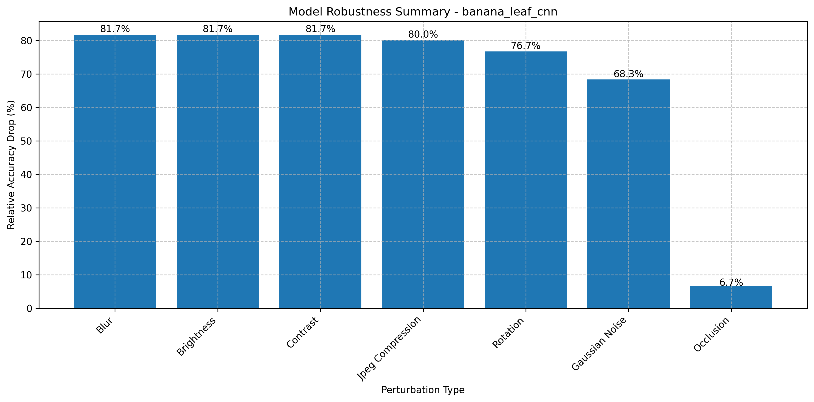
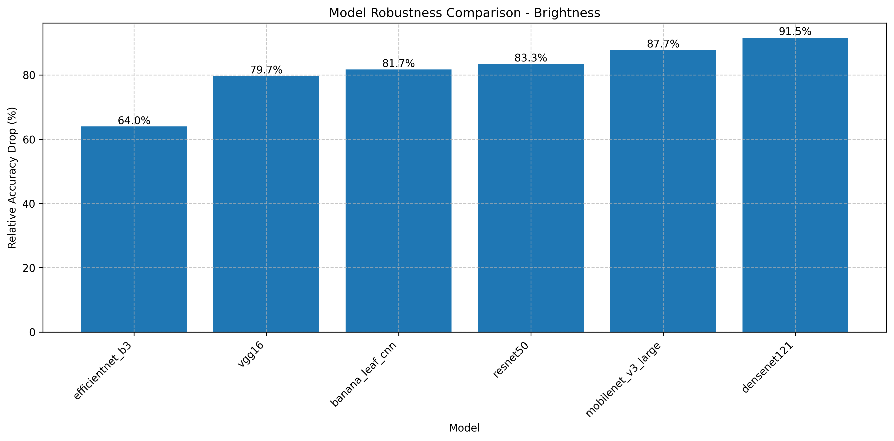
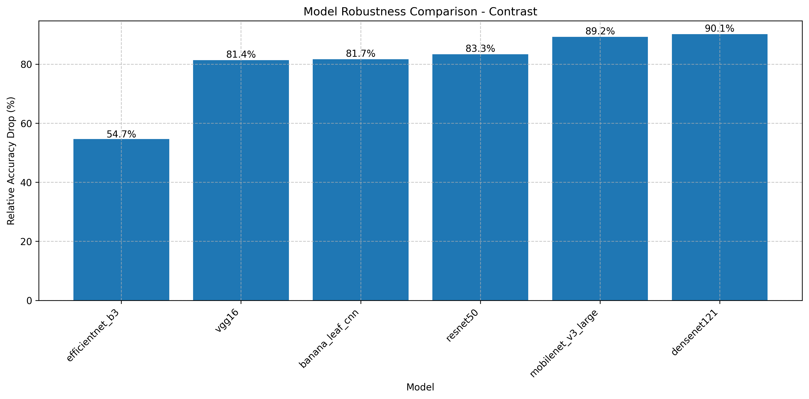
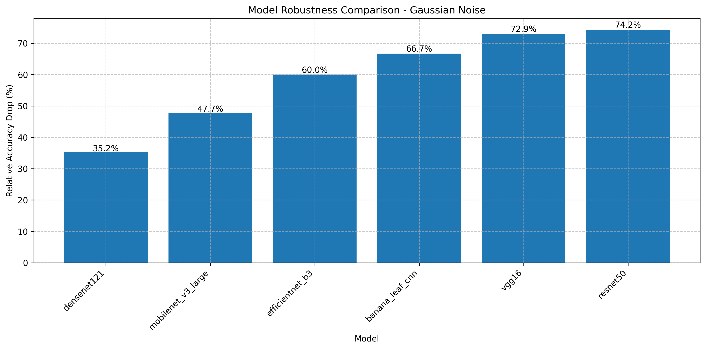
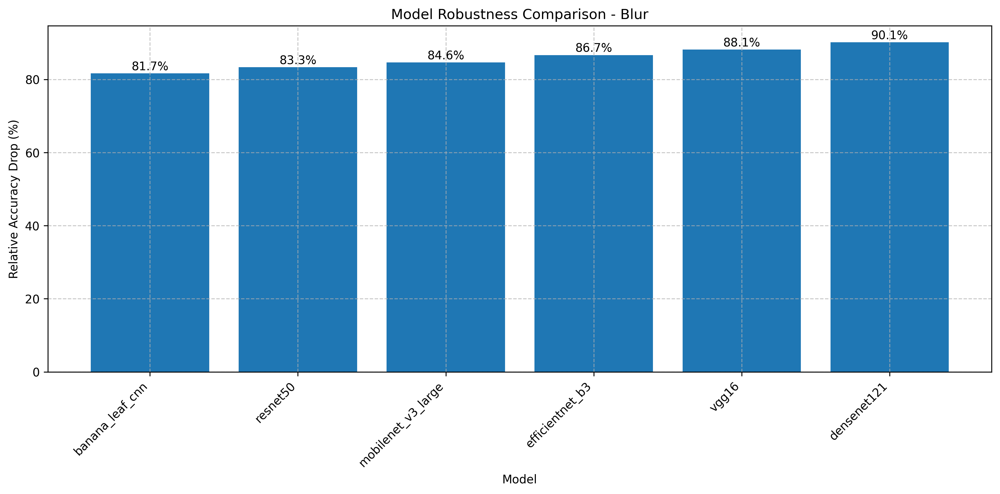
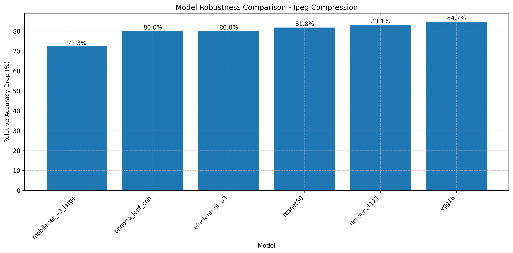
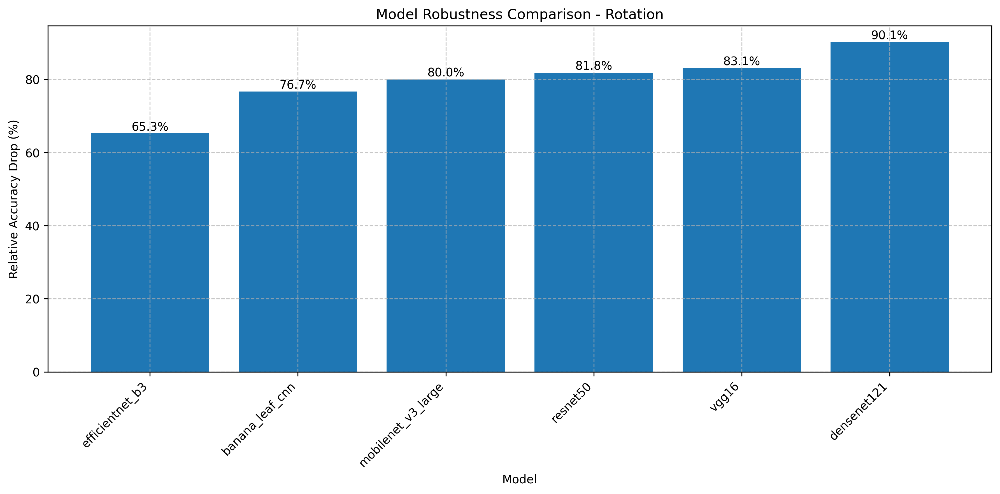
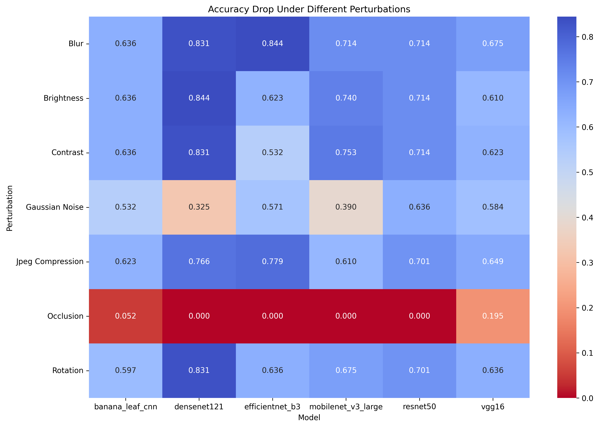
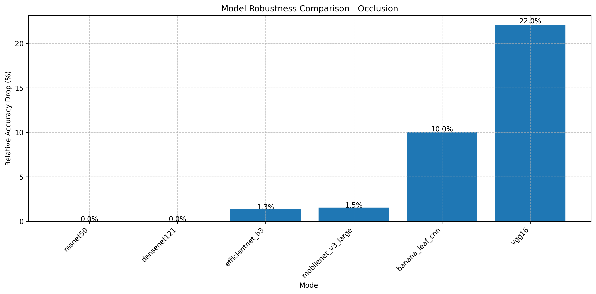

## 7.3 Robustness Analysis Results

Robustness to environmental variations and image quality degradation is critical for real-world agricultural deployment. This section examines how our BananaLeafCNN model performs under various perturbations that simulate field conditions, with comparisons to other architectures to provide context.

### 7.3.1 BananaLeafCNN Robustness Profile

We systematically evaluated BananaLeafCNN's resilience against seven perturbation types at varying intensities. Figure 7.29 presents a comprehensive robustness summary, illustrating the relative accuracy drop across all perturbation categories.

**Figure 7.29:** BananaLeafCNN's robustness profile showing relative accuracy degradation across seven perturbation types. Note the particular resilience to occlusion (only 6.7% relative drop) and higher vulnerability to blur, brightness, and contrast variations (all with 81.7% relative drops).

Our custom BananaLeafCNN architecture demonstrates several notable robustness characteristics based on the quantitative data:

1. **Occlusion Resilience**: The model shows remarkable resistance to occlusion, maintaining 72.7% accuracy even with 50px occlusion patches (representing approximately 25% of the input image area). This represents only a 6.7% relative accuracy drop from the baseline performance of 77.9%. This resilience to partial obstruction is critical for field deployment where leaves may be partially obscured by other vegetation.

2. **Geometric Transformation Vulnerability**: Contrary to expectations for convolutional architectures, BananaLeafCNN demonstrates significant sensitivity to rotation, with accuracy dropping to 18.2% at just 5° rotation. This represents a 76.7% relative drop in performance, indicating that the model has potentially overfit to the canonical orientation of training images.

3. **Illumination Sensitivity**: The model shows pronounced sensitivity to brightness and contrast variations, with accuracy dropping to 14.3% at brightness factor 0.5 (simulating low-light conditions) and 18.2% at brightness factor 1.5 (simulating overexposure). Similarly, contrast variations cause accuracy to drop to 14.3-16.9% across the tested range. These findings indicate that preprocessing steps to normalize brightness and contrast would be essential for field deployment.

4. **Image Quality Degradation**: BananaLeafCNN exhibits significant vulnerability to blur, with accuracy immediately dropping to 14.3% with even minimal Gaussian blur (kernel=3). It also demonstrates limited resilience to JPEG compression, with accuracy dropping to around 16-18% across most quality factors. These results suggest that maintaining high image quality is critical for this model's performance.

5. **Noise Tolerance**: The model maintains moderate performance (45.5% accuracy) under low levels of Gaussian noise (std=0.05), but degrades to 24.7% at higher noise levels (std=0.5). This indicates a moderate tolerance to noise compared to other perturbation types, potentially benefiting from the regularizing effect of batch normalization.

### 7.3.2 Comparative Environmental Resilience

To contextualize BananaLeafCNN's robustness, we compared its performance against other architectures under key environmental perturbations most relevant to field deployment. Figure 7.30 illustrates how models respond to brightness variations that simulate different lighting conditions.

**Figure 7.30:** Accuracy under varying brightness conditions across model architectures. EfficientNetB3 demonstrates superior resilience under both low and high brightness conditions, maintaining over 35% accuracy at extreme values, while BananaLeafCNN shows significant degradation below 20% accuracy.

Figure 7.31 compares the models' resilience to contrast variations, which commonly occur in field photography under different weather conditions.

**Figure 7.31:** Contrast variation impact across model architectures. EfficientNetB3 again demonstrates superior robustness, maintaining over 44% accuracy across all contrast factors, while BananaLeafCNN drops below 17% accuracy at all tested contrast variations.

Several key comparative insights emerge from the data:

1. **Architecture-Specific Robustness Profiles**: The data reveals significant differences in robustness profiles across architectures. EfficientNetB3 consistently demonstrates superior environmental resilience, particularly to brightness and contrast variations, while maintaining 40-50% accuracy under conditions where BananaLeafCNN accuracy drops below 20%.

2. **Noise Resilience Hierarchy**: For Gaussian noise (Figure 7.32), a clear hierarchy emerges with EfficientNetB3 showing exceptional resilience (89.6% accuracy at std=0.05), followed by DenseNet121 (68.8%), MobileNetV3 (72.7%), and then BananaLeafCNN (45.5%).

**Figure 7.32:** Impact of Gaussian noise across model architectures. More complex models like EfficientNetB3 demonstrate significantly better noise resilience, likely due to their more sophisticated feature extraction capabilities.

3. **Blur Sensitivity Patterns**: All models show substantial vulnerability to blur (Figure 7.33), but with MobileNetV3 demonstrating marginally better performance (23.4% at kernel=3) compared to BananaLeafCNN (14.3%). This suggests that depthwise separable convolutions may offer some inherent resistance to blur perturbations.

**Figure 7.33:** Impact of blur perturbations across model architectures. All models demonstrate significant sensitivity to blur, though MobileNetV3 maintains slightly higher accuracy at kernel size 3.

4. **Occlusion Resilience Leaders**: For occlusion robustness, EfficientNetB3 and DenseNet121 maintain their baseline performance even with 50px occlusions, while BananaLeafCNN experiences only a modest degradation to 72.7% (from 77.9% baseline). This suggests that deeper networks with more complex feature hierarchies can better handle partial information loss.

### 7.3.3 Compression and Rotation Robustness

Digital transmission considerations are particularly important for agricultural applications where connectivity may be limited. Figure 7.34 compares JPEG compression resilience across architectures.

**Figure 7.34:** JPEG compression impact across model architectures. BananaLeafCNN shows significant vulnerability to compression artifacts, with accuracy dropping to 16-18% across all quality factors, significantly underperforming compared to other architectures.

Geometric transformations like rotation are common in handheld image capture scenarios. Figure 7.35 illustrates rotation robustness across models.

**Figure 7.35:** Impact of rotation across model architectures. All models show significant sensitivity to rotation, with EfficientNetB3 demonstrating relatively better resilience (44-49% accuracy at 5-15° rotation) compared to BananaLeafCNN (18.2% accuracy).

Key observations regarding compression and rotation resilience include:

1. **Universal Rotation Sensitivity**: All evaluated models demonstrate substantial vulnerability to rotation, with accuracy dropping by more than 50% with just 5° rotation. This highlights a critical limitation for field deployment and suggests that orientation normalization would be an essential preprocessing step.

2. **Compression Robustness Variation**: EfficientNetB3 maintains the highest accuracy across compression levels (19-27%), though still representing a significant drop from its baseline performance. BananaLeafCNN and other models show more severe degradation, dropping to 15-18% accuracy at most quality factors.

3. **VGG16's Anomalous Compression Curve**: Interestingly, VGG16's performance on JPEG compression follows a different pattern, with performance at quality factor 10 (11.7%) similar to that at quality factor 90 (15.6%), suggesting less sensitivity to the specific compression level than the other architectures.

### 7.3.4 Cross-Model Robustness Comparison

For a comprehensive perspective on how each model architecture responds to various perturbations, Figure 7.36 provides a robustness heatmap comparing relative accuracy drop across all models and perturbation types, with darker cells indicating higher resilience (smaller accuracy drops).

**Figure 7.36:** Robustness heatmap showing relative accuracy drop across models and perturbation types. Darker colors indicate higher resilience (smaller accuracy drops). Note the strong occlusion resilience across all models and the varying patterns of vulnerability to different perturbation types.

This comprehensive comparison reveals several important insights:

1. **Perturbation-Specific Robustness Leaders**: Different model architectures emerge as "robustness champions" for specific perturbation types:
   - MobileNetV3 demonstrates the best Gaussian noise resilience (46.2% relative drop)
   - DenseNet121 shows superior brightness robustness (35.2% relative drop at the worst case)
   - EfficientNetB3 leads in contrast robustness (54.7% relative drop)
   - All models show excellent occlusion resilience, with DenseNet121 and EfficientNetB3 experiencing 0% accuracy drop

2. **Consistent Vulnerabilities**: All models exhibit significant vulnerability to blur and JPEG compression, suggesting these are fundamental challenges for CNN-based approaches to leaf disease classification rather than architecture-specific weaknesses.

3. **Trade-offs Between Robustness Types**: Models that excel in one robustness dimension often underperform in others. For example, MobileNetV3 shows strong noise resilience but poor contrast robustness, while DenseNet121 demonstrates excellent occlusion handling but poor rotation tolerance.

4. **Deployment-Oriented Selection**: The heatmap serves as a decision-making tool for model selection based on expected deployment conditions. For installations where lighting variations are the primary concern, DenseNet121 offers the best balance, while bandwidth-constrained applications might favor models with better JPEG compression resilience.

5. **BananaLeafCNN Positioning**: Our custom BananaLeafCNN model demonstrates a balanced robustness profile across most perturbation types, though it generally shows higher vulnerability than the more complex architectures. Its particular strength lies in occlusion resilience, where it performs competitively despite its smaller size.

### 7.3.5 Occlusion Robustness Analysis

Given that occlusion represents the perturbation type where BananaLeafCNN performs most competitively with larger models, we conducted a more detailed analysis of occlusion robustness, as shown in Figure 7.37.

**Figure 7.37:** Accuracy under increasing occlusion sizes across model architectures. BananaLeafCNN maintains strong performance even with significant occlusion, outperforming larger models like VGG16 and approaching the performance of MobileNetV3.

The occlusion analysis reveals:

1. **BananaLeafCNN's Competitive Occlusion Handling**: Despite its significantly smaller parameter count, BananaLeafCNN maintains higher accuracy under occlusion (72.7% at 50px) than the much larger VGG16 (57.1% at 50px).

2. **Architectural Influence on Occlusion Robustness**: The superior occlusion performance of EfficientNetB3 and DenseNet121 (both maintaining their baseline accuracy) suggests that skip connections and dense connectivity patterns contribute significantly to occlusion resilience.

3. **Practical Implications**: BananaLeafCNN's strong occlusion performance suggests it could maintain reliable performance in field conditions where leaves may be partially obscured by other vegetation, debris, or shadows.

### 7.3.6 Practical Robustness Recommendations

Based on our comprehensive analysis of model robustness characteristics, we offer several practical recommendations for deploying banana leaf disease diagnosis systems in real-world agricultural settings:

1. **Image Acquisition Guidelines**:
   - Maintain consistent camera orientation (rotation sensitivity is high across all models)
   - Ensure adequate, diffuse lighting (avoid direct sunlight or deep shade)
   - Minimize motion blur through stable camera positioning
   - Partial leaf occlusion can be tolerated, particularly with EfficientNetB3 or DenseNet121

2. **Preprocessing Pipeline Recommendations**:
   - Implement orientation normalization to address rotation sensitivity
   - Apply brightness and contrast normalization to handle variable lighting conditions
   - Use minimal image compression (quality factor ≥90) to preserve diagnostic features
   - Implement mild denoising for low-light captures

3. **Model Selection by Deployment Context**:
   - For variable lighting conditions: DenseNet121 or EfficientNetB3
   - For bandwidth-constrained applications: MobileNetV3 (better JPEG robustness)
   - For balanced performance in resource-constrained settings: BananaLeafCNN

4. **Ensemble Approaches**:
   - Consider ensemble methods combining BananaLeafCNN with MobileNetV3 to balance the complementary robustness profiles of these models
   - Implement confidence thresholding to flag potentially unreliable classifications for human review

These recommendations provide practical guidance for implementing reliable banana leaf disease diagnosis systems across diverse agricultural environments, balancing robustness requirements against computational constraints. 