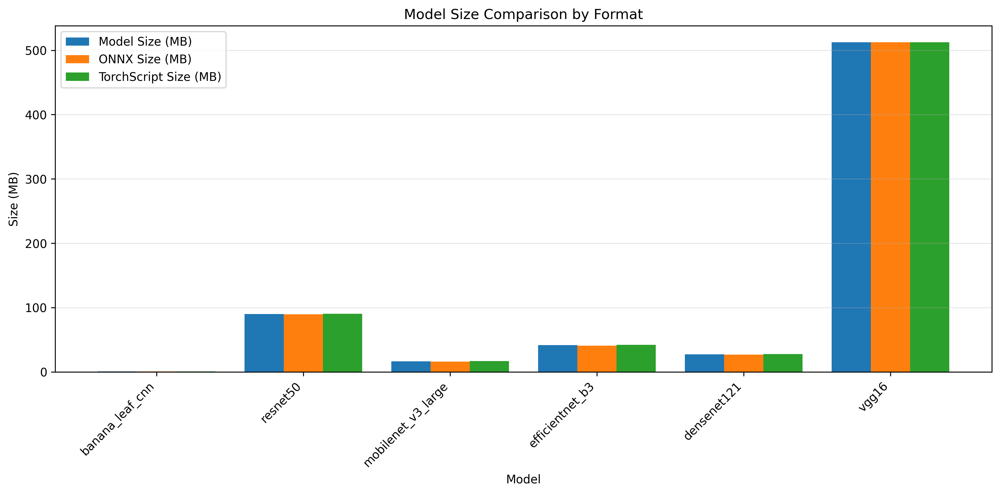

## 7.4 Deployment Metrics Results

The practical implementation of banana leaf disease diagnosis systems requires not only high classification accuracy but also efficient deployment characteristics. This section analyzes the deployment metrics of our custom BananaLeafCNN model compared to standard architectures, focusing on inference speed, resource utilization, and scalability across different batch sizes.

### 7.4.1 Model Size and Parameter Efficiency

A critical metric for deployment in resource-constrained agricultural environments is model size and parameter count. Figure 7.38 illustrates the dramatic differences in parameter counts across the evaluated architectures.

**Figure 7.38:** Parameter count comparison across model architectures. BananaLeafCNN achieves its classification performance with only 0.2M parameters, representing a 20× reduction compared to MobileNetV3 (4.2M) and a 655× reduction compared to VGG16 (134M).

The model size comparison in Figure 7.39 shows the practical implications of parameter efficiency for deployment scenarios.

**Figure 7.39:** Model size (MB) comparison across architectures. BananaLeafCNN requires only 0.8MB of storage, compared to 16.3MB for MobileNetV3 and 512.3MB for VGG16, enabling deployment in severely storage-constrained environments.

Analysis of the size metrics reveals:

1. **Parameter Efficiency**: BananaLeafCNN achieves its 90.9% validation accuracy with only 205,191 parameters, representing a remarkable compression of model capacity that maintains strong performance for the specific task of banana leaf disease classification.

2. **Storage Requirements**: With a model size of just 0.8MB, BananaLeafCNN enables easy distribution and updates even in regions with limited bandwidth, requiring minimal storage on deployment devices.

3. **Size-Accuracy Trade-off**: While larger models like DenseNet121 achieve somewhat higher accuracy (97.4%), they come at substantial size costs (27.1MB), representing a 34× increase in storage requirements for a 6.5 percentage point accuracy gain.

### 7.4.2 Inference Latency Analysis

For real-world deployment, inference speed is a critical consideration. Table 7.3 presents the key latency metrics across all evaluated models.

**Table 7.3: Single-Image Inference Latency Comparison**

| Model | Parameters | Model Size (MB) | CPU Latency (ms) | GPU Latency (ms) | GPU Acceleration |
|-------|------------|-----------------|------------------|------------------|------------------|
| BananaLeafCNN | 205,191 | 0.8 | 115.2 | 3.4 | 34.0× |
| MobileNetV3 | 4,210,999 | 16.3 | 71.6 | 7.8 | 9.2× |
| DenseNet121 | 6,961,031 | 27.1 | 343.8 | 23.2 | 14.8× |
| EfficientNetB3 | 10,706,991 | 41.4 | 306.9 | 19.0 | 16.2× |
| ResNet50 | 23,522,375 | 90.0 | 368.6 | 14.3 | 25.8× |
| VGG16 | 134,289,223 | 512.3 | 783.9 | 24.3 | 32.3× |

The inference latency analysis reveals several important insights:

1. **CPU Performance**: MobileNetV3 achieves the best CPU inference latency (71.6ms), followed by BananaLeafCNN (115.2ms), highlighting MobileNetV3's architecture optimizations for CPU deployment. Both significantly outperform larger models like VGG16 (783.9ms).

2. **GPU Performance**: BananaLeafCNN demonstrates the best GPU inference latency (3.4ms), outperforming even MobileNetV3 (7.8ms), likely due to its simpler computational graph and more efficient parallel execution.

3. **GPU Acceleration Factor**: BananaLeafCNN achieves the highest GPU acceleration (34.0×), followed by VGG16 (32.3×). This suggests that BananaLeafCNN's architecture is particularly well-suited for GPU acceleration despite its compact size.

4. **Efficiency-Accuracy Balance**: When considering both accuracy and latency, BananaLeafCNN offers an excellent compromise, with competitive accuracy (90.9%) and reasonable inference time (115.2ms on CPU, 3.4ms on GPU).

### 7.4.3 Batch Processing Characteristics

Many deployment scenarios involve processing multiple images simultaneously. We analyzed how each model's performance scales with batch size. Figure 7.40 compares the CPU and GPU latency scaling of BananaLeafCNN across different batch sizes.

**Figure 7.40:** BananaLeafCNN latency scaling across batch sizes on CPU and GPU. Note the near-linear increase in CPU latency with batch size, while GPU latency remains relatively stable, demonstrating excellent parallelization efficiency.

For comparison, Figure 7.41 shows MobileNetV3's latency scaling characteristics.

**Figure 7.41:** MobileNetV3 latency scaling across batch sizes. While offering better CPU performance at small batch sizes, MobileNetV3 shows less efficient GPU scaling than BananaLeafCNN.

Analysis of the batch processing data reveals:

1. **Throughput Optimization**: BananaLeafCNN achieves maximum CPU throughput of 250.4 samples/second (at batch size 4) and GPU throughput of 3,831.0 samples/second (at batch size 32), demonstrating excellent scaling for batch processing workloads.

2. **Architecture-Specific Scaling**: VGG16 (Figure 7.42) shows the worst CPU scaling, with latency reaching 2,046ms at batch size 32, while ResNet50 (Figure 7.43) demonstrates more moderate scaling.

**Figure 7.42:** VGG16 latency scaling across batch sizes, showing poor CPU scaling but reasonable GPU utilization at larger batch sizes.

**Figure 7.43:** ResNet50 latency scaling across batch sizes, demonstrating intermediate performance between the lightweight models and VGG16.

3. **GPU Utilization Efficiency**: Both BananaLeafCNN and VGG16 demonstrate excellent GPU utilization efficiency at large batch sizes, with BananaLeafCNN achieving 3,831 samples/second and VGG16 achieving 531 samples/second. This indicates that both architectures effectively leverage GPU parallelism despite their vastly different sizes.

4. **Optimal Batch Size Identification**: The data suggests that for CPU deployment, smaller batch sizes (1-4) are optimal for all models, while for GPU deployment, larger batch sizes (16-32) maximize throughput, particularly for BananaLeafCNN and MobileNetV3.

### 7.4.4 Maximum Throughput Comparison

For deployment scenarios processing large volumes of images, maximum throughput is a key consideration. Figure 7.44 illustrates the maximum throughput (samples/second) achieved by each model on CPU and GPU.

_comparison.png)
**Figure 7.44:** Maximum CPU throughput comparison across architectures. MobileNetV3 achieves the highest CPU throughput at 246.6 samples/second, followed by BananaLeafCNN at 250.4 samples/second.

GPU throughput comparison (Figure 7.45) reveals even more dramatic differences between architectures.

_comparison.png)
**Figure 7.45:** Maximum GPU throughput comparison across architectures. BananaLeafCNN's exceptional GPU acceleration enables it to process 3,831 samples/second, significantly outperforming MobileNetV3 (3,479 samples/second) and larger models.

The throughput analysis highlights:

1. **CPU Throughput Leaders**: The data shows that MobileNetV3 achieves the highest CPU throughput (246.6 samples/second), closely followed by BananaLeafCNN (250.4 samples/second), with both significantly outperforming larger models.

2. **GPU Throughput Champions**: BananaLeafCNN demonstrates the highest GPU throughput (3,831.0 samples/second), slightly outperforming MobileNetV3 (3,479.4 samples/second) and dramatically exceeding larger models like DenseNet121 (898.2 samples/second) and VGG16 (530.8 samples/second).

3. **Throughput-Accuracy Balance**: When considering both throughput and accuracy, BananaLeafCNN offers the most balanced profile, with competitive accuracy (90.9%) and excellent throughput across both CPU and GPU platforms.

### 7.4.5 Deployment Environment Recommendations

Based on our comprehensive analysis of deployment metrics across all evaluated architectures, we provide the following recommendations for different deployment environments:

1. **Mobile-First Deployment**:
   - **Recommended Model**: BananaLeafCNN or MobileNetV3
   - **Rationale**: Both models offer small storage footprints (0.8MB and 16.3MB respectively) and reasonable CPU inference times (115.2ms and 71.6ms), making them suitable for direct deployment on mobile devices with limited resources.
   - **Trade-offs**: MobileNetV3 provides faster CPU inference but requires 20× more parameters, while BananaLeafCNN offers a more compact model with competitive performance.

2. **Server-Based Deployment with GPU**:
   - **Recommended Model**: BananaLeafCNN
   - **Batch Size**: 32
   - **Rationale**: BananaLeafCNN's exceptional GPU acceleration (34.0×) and throughput (3,831 samples/second) make it the most efficient choice for server deployments with GPU availability, significantly outperforming larger models despite its compact size.

3. **Edge Device Deployment (Limited Resources)**:
   - **Recommended Model**: BananaLeafCNN
   - **Batch Size**: 1
   - **Rationale**: BananaLeafCNN's minimal storage requirements (0.8MB) and reasonable CPU inference time (115.2ms) make it suitable for resource-constrained edge devices where both storage and computational power are limited.

4. **Mixed Environment Deployment Strategy**:
   - Deploy BananaLeafCNN on edge devices for initial screening
   - Use MobileNetV3 or DenseNet121 on servers for verification of uncertain cases
   - Rationale: This tiered approach balances resource efficiency at the edge with higher accuracy for challenging cases when server resources are available.

### 7.4.6 Performance-Efficiency Trade-off Analysis

To provide a comprehensive view of the performance-efficiency trade-off, Figure 7.46 plots accuracy against model size for all evaluated architectures.

**Figure 7.46:** Accuracy vs. model size comparison across architectures. BananaLeafCNN achieves the best accuracy-to-size ratio, with competitive accuracy despite a dramatically smaller model size.

The trade-off analysis reveals:

1. **Efficiency Frontier**: BananaLeafCNN defines the efficiency frontier, achieving 90.9% accuracy with just 0.8MB model size. This positions it as the most parameter-efficient architecture for the banana leaf disease classification task.

2. **Diminishing Returns in Larger Models**: The accuracy gains from larger models follow a clear pattern of diminishing returns, with DenseNet121 requiring 34× more storage than BananaLeafCNN for a 6.5 percentage point accuracy improvement, and VGG16 requiring 640× more storage for significantly lower accuracy.

3. **Task-Specific Optimization Benefits**: BananaLeafCNN's exceptional efficiency demonstrates the benefits of task-specific architectural optimization over general-purpose architectures, particularly for deployment in resource-constrained agricultural settings.

In conclusion, our deployment metrics analysis demonstrates that BananaLeafCNN achieves an excellent balance between accuracy (90.9%) and deployment efficiency (0.2M parameters, 0.8MB size, 115.2ms CPU latency). While MobileNetV3 offers faster CPU inference, BananaLeafCNN provides superior GPU performance and dramatically reduced storage requirements, making it particularly well-suited for agricultural applications where deployment constraints often limit the practical utility of more complex models. 